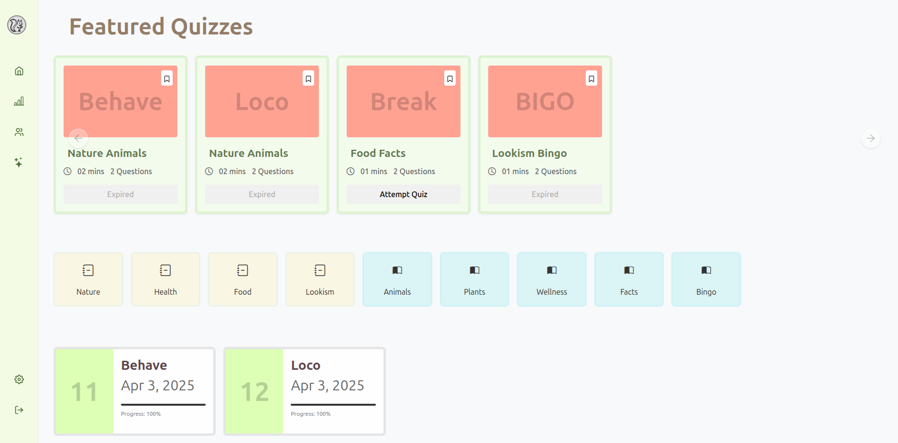
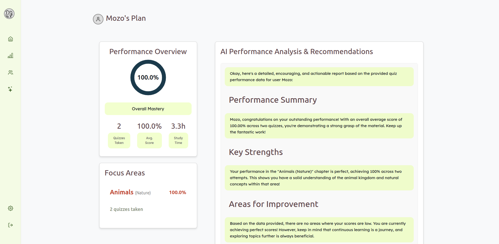
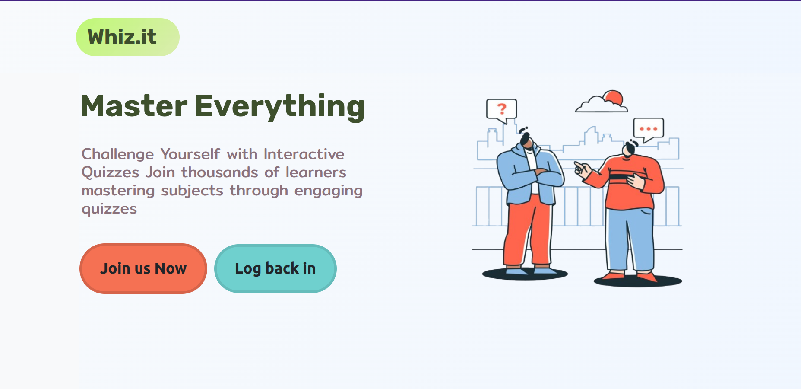
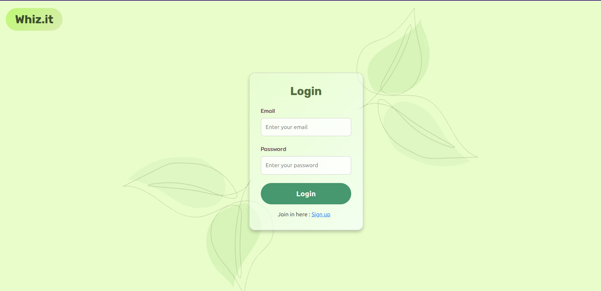
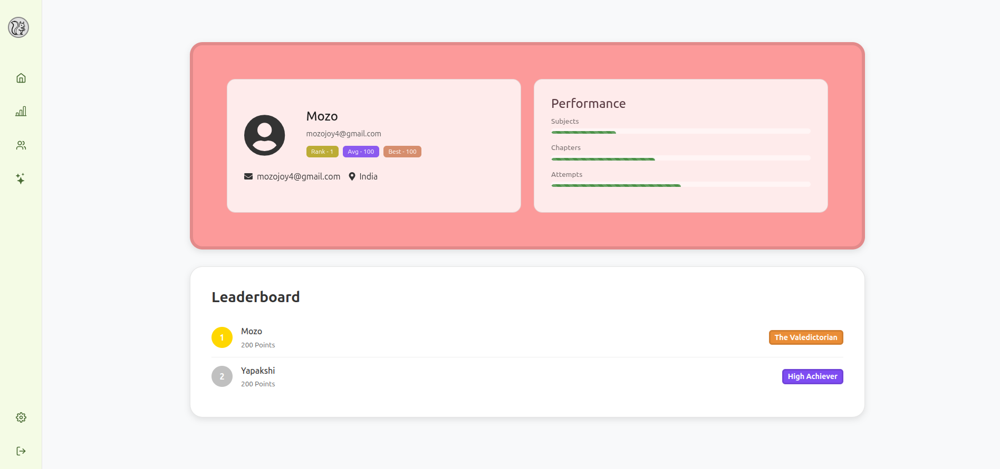
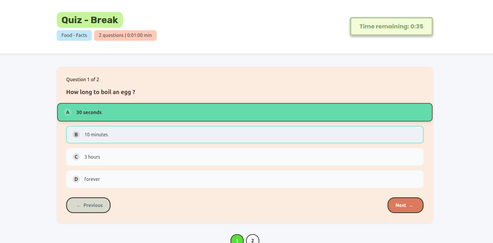
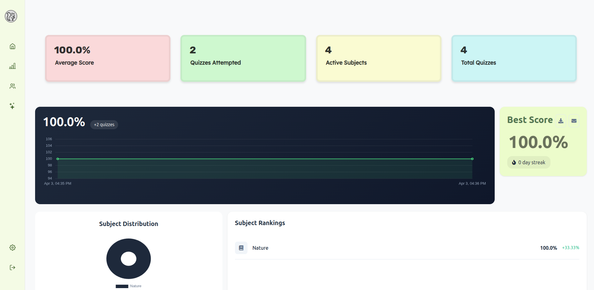
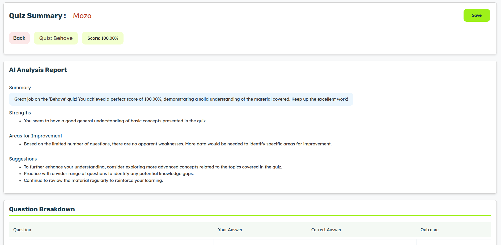
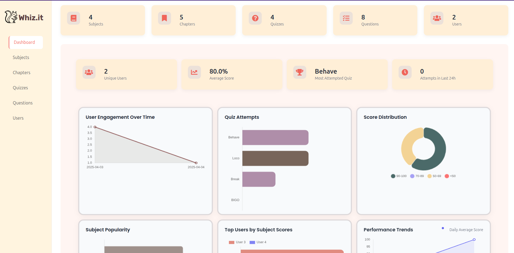
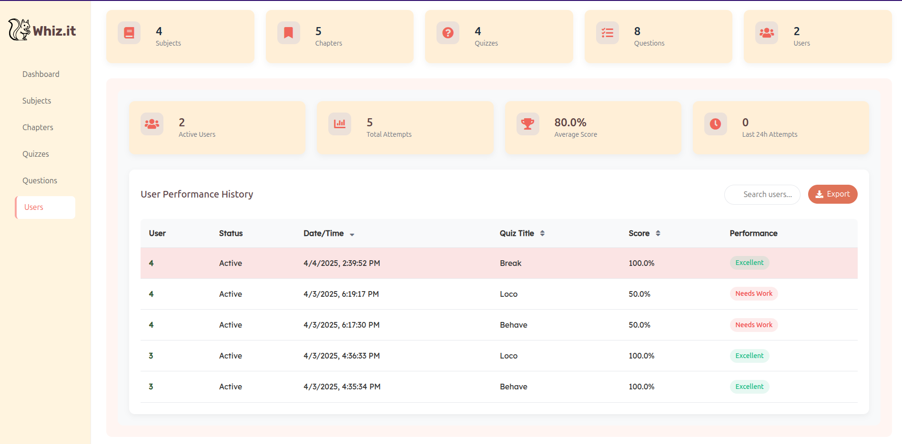

# Whiz.it - The Intelligent Quiz Master

[](https://opensource.org/licenses/MIT)


**Whiz.it** is a modern, fresh, and minimalist quiz master application designed to provide an engaging and insightful learning experience. Users can test their knowledge across various subjects and chapters, benefit from instant AI-powered feedback, track their progress, and engage with a comprehensive set of features to enhance their learning journey.

## ✨ Key Features

* **Diverse Quizzes:** Attempt quizzes organized by subjects and chapters.
* **Bookmarks:** Save questions for later review.
* **Score Revisits:** Access and analyze past quiz scores.
* **Instant AI Feedback:** Receive immediate, intelligent feedback on answers powered by Google Generative AI.
* **Score History:** Track the evolution of your performance over time.
* **User Profiles:** Personalized profiles with a leaderboard to foster healthy competition.
* **Dedicated Summary Page:** A consolidated view of your quiz activity and progress.
* **Report Generation:** Options to download and email detailed quiz reports.
* **Daily Reminders:** Stay on track with daily quiz reminders delivered via email.
* **Monthly Activity Reports:** Gain insights into your monthly learning activity through comprehensive email reports.
* **AI-Powered Analysis Page:** Delve deeper into your strengths and weaknesses with intelligent analysis powered by AI.
* **Admin Panel (RBAC):** A robust administration interface with Role-Based Access Control (RBAC) for platform management.
* **Modern UI:** A clean and minimalist user interface built with Vue 3 Options API.

## 🛠️ Built With

* **Backend:**
    * [Python](https://www.python.org/)
    * [Flask](https://flask.palletsprojects.com/) - A microframework for Python based on Werkzeug, Jinja 2 and good intentions.
    * [Celery](https://docs.celeryq.dev/) - A distributed task queue.
    * [Celery Beat](https://docs.celeryq.dev/en/stable/schedule.html) - A scheduler for Celery tasks.
    * [Redis](https://redis.io/) - An in-memory data structure store, used for caching and as a message broker.
    * [Flask-Mailman](https://flask-mailman.readthedocs.io/en/stable/) - A Flask extension for sending emails.
    * [Google Generative AI](https://ai.google.dev/) - For providing intelligent feedback on quiz answers.
* **Frontend:**
    * [Vue.js](https://v3.vuejs.org/) - A progressive JavaScript framework.
    * [Vue 3 Options API](https://vuejs.org/guide/introduction.html#options-api) - The Options API for structuring Vue components.

## 🚀 Getting Started

To get Whiz.it up and running on your local machine, follow these steps:

### Prerequisites

* Python 3.x
* Node.js and npm (or yarn)
* Redis server installed and running
* Google Cloud Project with the Generative AI API enabled and API key configured
* Email service credentials for Flask-Mailman
### Installation

1.  **Clone the repository:**
    ```bash
    git clone <repository_url>
    cd whiz.it
    ```

2.  **Set up the backend (ServerA):**
    ```bash
    cd serverA
    python -m venv venv
    source venv/bin/activate  # On Windows, use `venv\Scripts\activate`
    pip install -r requirements.txt
    ```

3.  **Configure environment variables for the backend:**
    Create a `.env` file in the `root` directory and configure the following environment variables:
    ```
    GOOGLE_API_KEY = ''
    # Database
    SQLALCHEMY_DATABASE_URI = 'sqlite:///quizmdb.db'

    # JWT
    JWT_SECRET_KEY = ''

    # Redis and Celery
    REDIS_URL = 'redis://localhost:6379/0'
    CELERY_BROKER_URL = 'redis://localhost:6379/0'
    CELERY_RESULT_BACKEND = 'redis://localhost:6379/0'

    # Caching
    CACHE_TYPE = 'redis'
    CACHE_REDIS_URL = 'redis://localhost:6379/0'
    CACHE_DEFAULT_TIMEOUT = 300

    # Mail
    MAIL_SERVER = 'your_mail_server.com' 
    MAIL_PORT = 587                     
    MAIL_USE_TLS = True                 
    MAIL_USERNAME = 'your_email@example.com'   
    MAIL_PASSWORD = ''
    MAIL_DEFAULT_SENDER = 'Whiz.it <noreply@example.com>' 
    ```
    **Note:** Make sure to replace the placeholder values (e.g., `your_mail_server.com`, email addresses, passwords, JWT secret key, and Google API key) with your actual configuration.

    

4.  **Run the Redis server:**
    Ensure your Redis server is running. You might need to start it in a separate terminal if it's not already running as a service.

    ```bash
    redis-server
    ```

5.  **Run the Celery worker and beat (from `serverA`):**
    Open two separate terminal windows in the `serverA` directory:
    ```bash
    celery -A run.celery worker -l info
    celery -A run.celery beat -l info
    ```
    *(Assuming you have initialized your Celery app instance as `celery` in your `run.py` file.)*

6.  **Run the Flask development server (from `serverA`):**
    ```bash
    python run.py
    ```
    The backend API will likely be accessible at `http://localhost:5000`.


7.  **Configure frontend environment variables:**
    Create a `.env` file in the `frontend` directory (if needed) to configure API endpoints (e.g., pointing to `http://localhost:5000`) or other environment-specific settings.


## ⚙️ Usage

Once the application is running, users can:

* **Browse Quizzes:** Explore available quizzes by subject and chapter.
* **Attempt Quizzes:** Select a quiz and answer the questions.
* **Receive AI Feedback:** Get instant explanations and insights on their answers.
* **Manage Bookmarks:** Add and review challenging questions later.
* **View Scores:** Check past quiz results and track their progress.
* **Access Profile:** See their leaderboard ranking and manage their account.
* **Explore Summary:** Get a quick overview of their quiz activity.
* **Download/Email Reports:** Generate and share their performance reports.
* **Receive Notifications:** Get daily quiz reminders and monthly activity summaries via email.
* **Utilize AI Analysis:** Gain deeper insights into their learning patterns and areas for improvement.

Administrators can access the admin panel (usually at a specific route like `/admin`) to manage users, quizzes, subjects, chapters, and other platform configurations based on their assigned roles.

## 🖼️ Screenshots

Here are some screenshots of the application:

### User Dashboard


### AI Report


### Landing Page


### Login Page


### User Profile


### Quiz Page


### Summary Page


### AI Feedback


### Admin Dashboard


### Admin Panel


## 📄 License

This project is licensed under the MIT License - see the [LICENSE](LICENSE.txt) file for details.

## 🙏 Acknowledgements

* Thanks to the developers of Flask, Vue.js, Celery, Redis, Flask-Mailman, and Google Generative AI for their amazing tools and libraries.
* *Also I am grateful to the IITM BS Modern Application Dedvelopmet team for their continued support throughout*

## 📬 Contact
*atharvkhare18@gmail.com*
*(atharvk4u.vercel.app)*